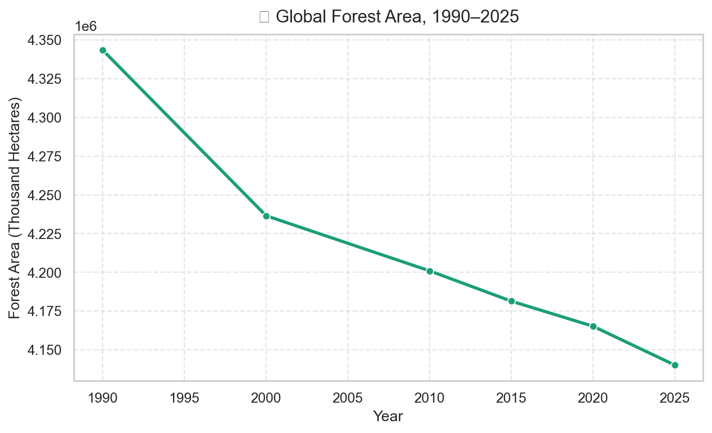
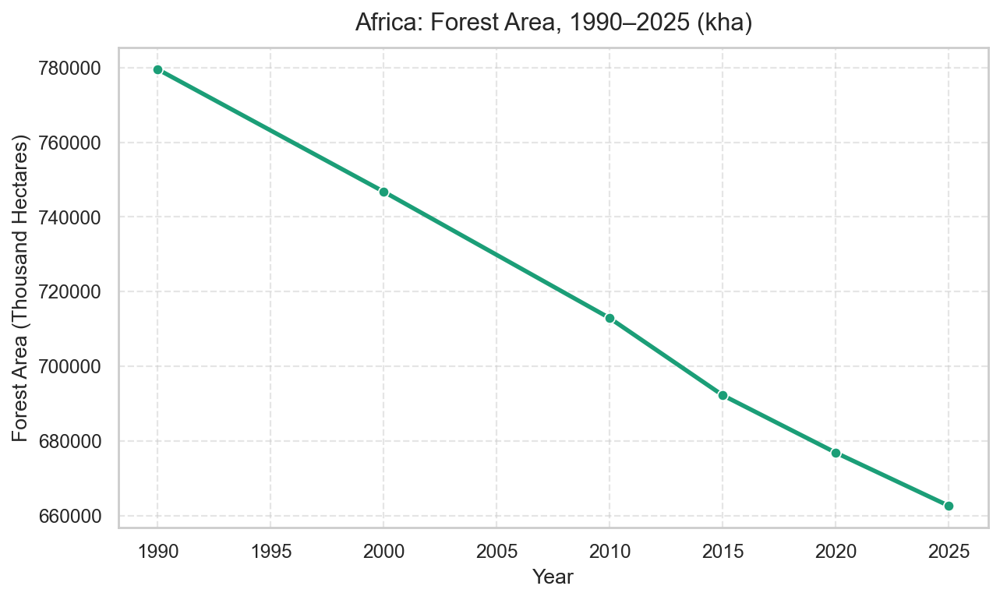
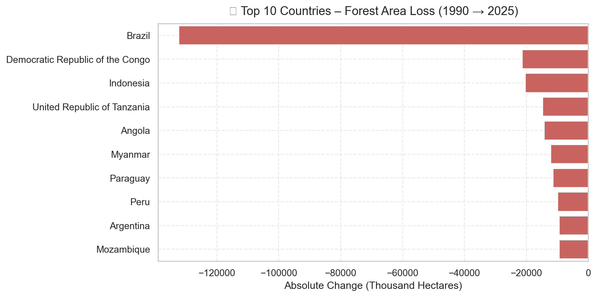
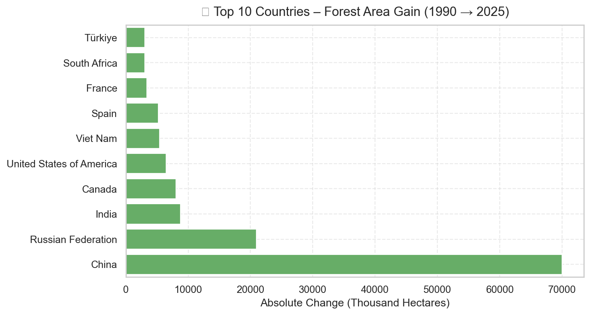
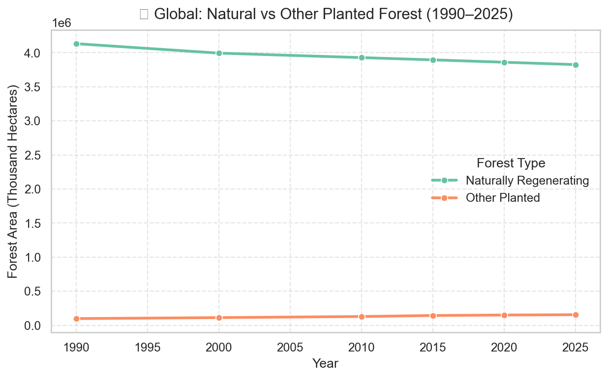
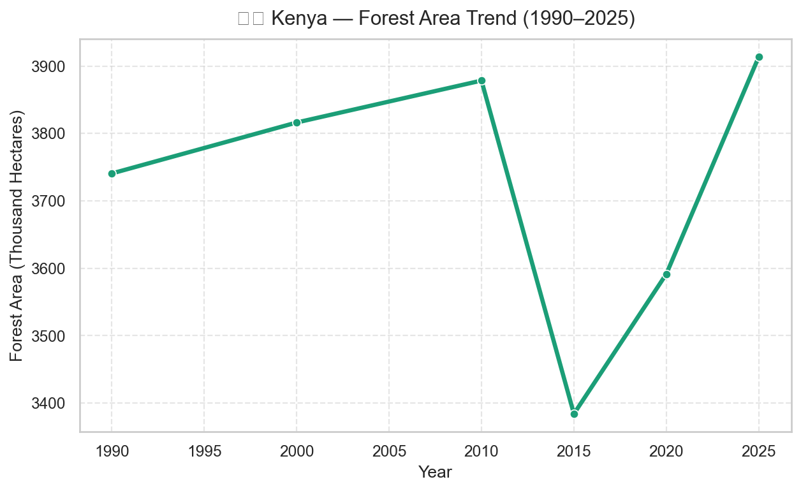
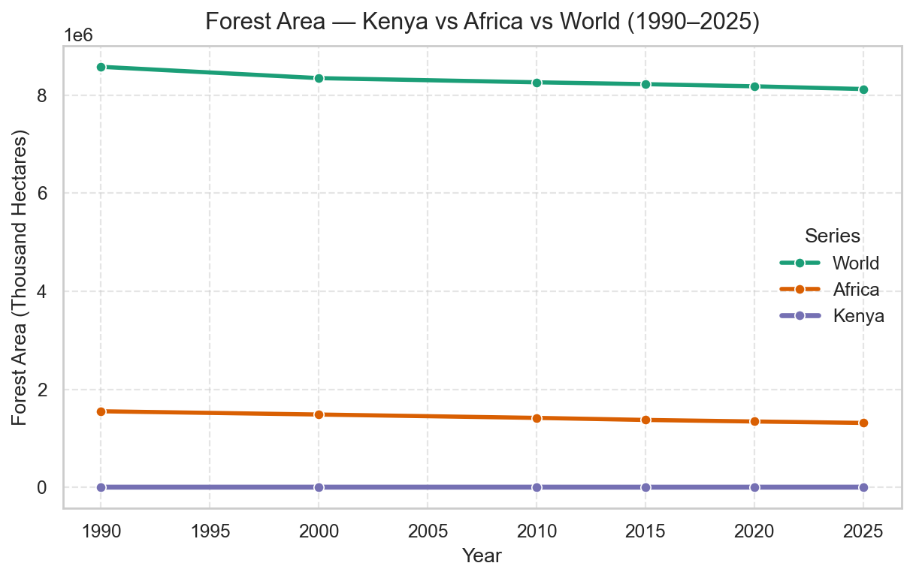
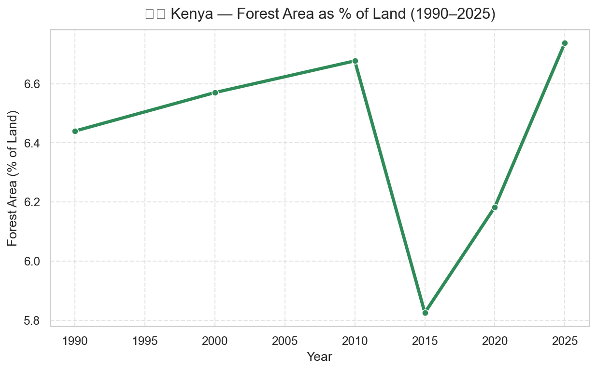

#  Global Forest Area & Deforestation Trends (1990–2025)

A data-driven exploration of global forest dynamics using FAO’s **Global Forest Resources Assessment (FRA 2025)** dataset.

---

##  Overview

**Goal:** Quantify and visualize how global and regional forest area changed between **1990–2025**, highlighting trends in forest loss, gains, and recovery.

**Motivation:** Forests are critical for biodiversity and climate regulation. This project transforms open FAO data into actionable insights that can inform environmental policy and public awareness.

---

##  Objectives

- Compute **forest area trends** globally, regionally, and nationally.
- Identify **top 10 countries** with the highest forest loss and gain.
- Produce a **reproducible Jupyter Notebook** pipeline (Python).
- Export **tidy CSVs** for BI tools (Power BI / Tableau).
- Communicate findings through **visuals and summary narratives**.

---

##  Data Source

| Item | Description |
|------|--------------|
| Dataset | FAO Global Forest Resources Assessment (FRA 2025) |
| Files Used | 1a_ForestArea, 1b_NaturallyRegeneratingForest, 1b_OtherPlantedForest |
| Reference Years | 1990 · 2000 · 2010 · 2015 · 2020 · 2025 |
| Units | Thousand hectares (kha) |
| Access | [https://fra-data.fao.org/](https://fra-data.fao.org/) |

---

##  Research Questions

1. How has global forest area changed from 1990 → 2025?
2. Which regions gained or lost the most forest area?
3. Which countries are the largest contributors to forest loss/gain?
4. (Optional) How do naturally regenerating vs planted forests compare?
5. (Case Study) How are **Kenya’s forests** evolving over the same period?

---

##  Methodology

### Data Pipeline
**Ingest → Clean → Standardize → Validate → Analyze → Visualize → Report**

| Step | Action |
|------|---------|
| Ingest | Load CSVs from FRA_Years_variables automatically (no hardcoding) |
| Clean & Tidy | Convert wide-format year columns to long (1990–2025) |
| Standardize | Rename columns → region, iso3, country, year, forest_area_kha, variable_type |
| Validate | Handle nulls, duplicates, and ensure correct units |
| Analyze | Compute absolute change, % change, CAGR |
| Visualize | Use Seaborn/Matplotlib for global, regional, and country insights |
| Report | Save results to /outputs/ and summary markdown |

---

##  Metrics

| Metric | Formula | Description |
|---------|----------|-------------|
| Absolute Change | 2025 − 1990 | Forest area difference (kha) |
| % Change | ((2025−1990)/1990)×100 | Relative change |
| CAGR | ((2025/1990)^(1/n)−1)×100 | Compound annual growth rate, n=35 years |

---

##  Folder Structure

```
Global-Forest-Trends/
│
├── data/
│   ├── raw/
│   └── processed/
├── notebooks/
│   └── FRA_Forestry_Project.ipynb
├── outputs/
│   ├── top10_losses.csv
│   ├── top10_gains.csv
│   ├── forest_area_tidy.csv
│   └── figures/
│       ├── global_forest_trend.png
│       ├── region_trend_<region>.png
│       ├── top10_losses_bar.png
│       ├── top10_gains_bar.png
│       ├── global_natural_vs_other_planted.png
│       └── kenya_forest_trend.png
├── src/
│   └── data_cleaning.py
├── docs/
│   └── report.md
├── requirements.txt
└── README.md
```

---

##  Visual Highlights

| Chart | Description |
|--------|--------------|
|  Global Trend | Forest area change (1990–2025) |
|  Regional Trends | Forest change by continent |
|  Top 10 Loss | Countries with greatest forest decline |
|  Top 10 Gain | Countries with greatest reforestation |
|  Natural vs Planted | Global comparison by forest type |
| 🇰🇪 Kenya Focus | Local case study trend and % of land |

---

## 🇰🇪 Kenya Forest Trends (1990–2025)

- **Forest Area:** Gradual decline between 1990–2010, with mild recovery toward 2025.
- **Regional Comparison:** Kenya mirrors broader African forest trends but shows slower decline.
- **Insight:** Afforestation programs may be helping to stabilize forest cover.

---

##  Key Insights

1. Global forest area continues to decline — net negative change since 1990.
2. Asia and Europe show the strongest recovery trends.
3. Africa and South America lead in total forest loss.
4. Reforestation efforts (planted forests) are increasing but not yet offsetting natural loss.
5. Kenya shows early signs of recovery in the 2020–2025 period.

---

##  Limitations & Ethics

- National reporting differences may affect precision.
- Interpret this as trend analysis, not exact measurements.
- Cite: FAO Global Forest Resources Assessment 2025.
- Avoid causal claims; this is descriptive analytics.

---

##  Future Extensions

- Add carbon stock (2d) data to link forests and emissions.
- Combine with population data → forest area per capita.
- Integrate with Power BI dashboard for stakeholder use.
- Automate updates via FAO API.

---

##  Author

**Davis Mironga**  
_Data Analyst | Environmental Data Projects_  

---

##  Tools Used

- Python: Pandas, NumPy, Matplotlib, Seaborn
- Notebook: Jupyter
- Visualization: Power BI
- Version Control: Git & GitHub

---

##  References

- Food and Agriculture Organization (FAO).  
  *Global Forest Resources Assessment 2025.*  
  [https://fra-data.fao.org/](https://fra-data.fao.org/)

---

## Figure Gallery

_Selected outputs from the analysis (rendered from `outputs/figures/`)._

<table><tbody><tr><td><div align="center" style="padding:8px"><br><sub> Global Forest Trend</sub></div></td><td><div align="center" style="padding:8px"><br><sub> Regional Trend (Africa)</sub></div></td></tr><tr><td><div align="center" style="padding:8px"><br><sub> Top 10 Loss</sub></div></td><td><div align="center" style="padding:8px"><br><sub> Top 10 Gain</sub></div></td></tr><tr><td><div align="center" style="padding:8px"><br><sub> Natural vs Other Planted</sub></div></td><td><div align="center" style="padding:8px"><br><sub>🇰🇪 Kenya Trend</sub></div></td></tr><tr><td><div align="center" style="padding:8px"><br><sub>🇰🇪 Kenya vs Africa vs World</sub></div></td><td><div align="center" style="padding:8px"><br><sub>🇰🇪 Forest % of Land ()</sub></div></td></tr></tbody></table>
